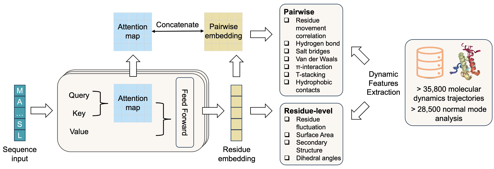

# SeqDance and ESMDance: Protein Language Models Trained on Protein Dynamic Properties

## Abstract
Proteins function by folding amino acid sequences into dynamic structural ensembles. Despite the critical role of protein dynamics, their inherent complexity and the lack of efficient integration methods have hindered their incorporation into deep learning models. To address this, we developed **SeqDance** and **ESMDance**, protein language models pre-trained on dynamic biophysical properties derived from molecular dynamics (MD) trajectories of over **35,800 proteins** and normal mode analyses (NMA) of over **28,500 proteins**.

SeqDance, which operates solely on sequence input, captures both **local dynamic interactions** and **global conformational properties** for ordered and disordered proteins, even for proteins without homologs in the pre-training dataset. Predicted dynamic property changes from SeqDance are predictive of mutation effects on protein folding stability. ESMDance, which utilizes **ESM2 outputs**, significantly outperforms ESM2 in zero-shot mutation effect prediction for designed and viral proteins. Together, SeqDance and ESMDance provide novel insights into protein behaviors and mutation effects through the lens of protein dynamics.



## Data and Model Weights
- **Training sequences and extracted features:** [Hugging Face](https://huggingface.co/datasets/ChaoHou/protein_dynamic_properties)  
- **Pre-trained SeqDance/ESMDance weights:**  
  - [](https://doi.org/10.5281/zenodo.15047777) (Version v2)  
  - [Hugging Face SeqDance](https://huggingface.co/ChaoHou/SeqDance)  
  - [Hugging Face ESMDance](https://huggingface.co/ChaoHou/ESMDance)  
- **Code for model usage:** [notebook](./notebook/zero_shot_mutation.ipynb)  

## SeqDance/ESMDance Pre-training
SeqDance and ESMDance both consist of **Transformer encoders** with **dynamic property prediction heads**. The Transformer encoder follows the **ESM2-35M** architecture, with **12 layers and 20 attention heads per layer**. Both models take protein sequences as input and predict **residue-level and pairwise dynamic properties**. The dynamic property prediction heads contain **1.2 million trainable parameters**.

- **SeqDance:** All parameters were **randomly initialized**, allowing the model to learn dynamic properties from scratch.
- **ESMDance:** All **ESM2-35M parameters were frozen**, leveraging evolutionary information from ESM2-35M to predict dynamic properties.

For details, refer to the code in the [model](./model/) directory.

### Step 1: Data Preparation
Download and process the data as described in [Hugging Face](https://huggingface.co/datasets/ChaoHou/protein_dynamic_properties) (Merging HDF5 Files). Update file paths in [config.py](./model/config.py).

### Step 2: Environment Setup & Training
A conda environment with `pytorch=2.5.1`, `transformers=4.48.2`, and `h5py` is enough for pre-training in our experiment. You can also use SeqDance_env.yml.
```bash
conda env create -f SeqDance_env.yml
conda activate seqdance
python -m torch.distributed.run --nnodes=1 --nproc_per_node=4 model/train_ddp.py
```
SeqDance/ESMDance were trained using [Distributed Data Parallel (DDP)](https://pytorch.org/tutorials/intermediate/ddp_tutorial.html). Training took **10 days** on a server with **four L40s GPUs**. Hyperparameters are listed in [config.py](./model/config.py).

## SeqDance/ESMDance Usage

### Zero-shot Prediction of Mutation Effects
Predict **dynamic properties** for wild-type and mutated sequences, calculate their **relative changes**, and infer mutation effects.
- Code: [Zero-shot mutation prediction](./notebook/zero_shot_mutation.ipynb)


### Applications of SeqDance Embeddings
**SeqDance embeddings** encode **rich biophysical properties** and outperform **ESM2-650M** in predicting **conformational properties** for both ordered and disordered proteins.  
- Code: [Embedding conformational property analysis](./notebook/embedding_conformation_property.ipynb)

### SeqDance's attention
**SeqDance's attention** effectively captures **protein dynamic interactions** from sequence alone, performing comparably to ESM2-35M while using only **1/1000th** of its training sequences.  
- Code: [Attention analysis](./notebook/attention_analysis.ipynb)

## Protein Dynamic Dataset
All datasets used in SeqDance are **publicly available**.

| Source | Description | Number | Method |
|--------|-------------|--------|--------|
| [mdCATH](https://huggingface.co/datasets/compsciencelab/mdCATH) | Ordered structures in PDB | 5,392 | All-atom MD, 5×464 ns |
| [ATLAS](https://www.dsimb.inserm.fr/ATLAS/index.html) | Ordered structures (no membrane proteins) | 1,516 | All-atom MD, 3×100 ns |
| [PED](https://proteinensemble.org/) | Disordered regions | 382 | Experimental and other methods |
| [GPCRmd](https://www.gpcrmd.org/) | Membrane proteins | 509 | All-atom MD, 3×500 ns |
| [IDRome](https://github.com/KULL-Centre/_2023_Tesei_IDRome) | Disordered regions | 28,058 | Coarse-grained MD, converted to all-atom |
| [ProteinFlow](https://github.com/adaptyvbio/ProteinFlow) | Ordered structures in PDB | 28,546 | Normal mode analysis |

## Feature Extraction

### MD Trajectory Feature Extraction
**Residue-level features:** RMSF, surface area, secondary structure (eight classes), dihedral angles (phi, psi, chi1).  
**Pairwise features:** Correlation of **Cα movements**, and **frequencies** of hydrogen bonds, salt bridges, Pi-cation, Pi-stacking, T-stacking, hydrophobic, and van der Waals interactions.

- **Interaction extraction:** [GetContacts](https://getcontacts.github.io/)
```bash
cd data_prepare/molecular_dynamics
get_dynamic_contacts.py --itypes hb sb pc ps ts hp vdw --cores 2 --topology 3tvj_I.pdb --trajectory 3tvj_I_10frames.dcd --output 3tvj_I_10frames_contact.tsv
```
- **Feature extraction:** [MDTraj v1.9.9](https://www.mdtraj.org/)
```bash
python MD_features.py -p 3tvj_I.pdb -t 3tvj_I_10frames.dcd -i 3tvj_I_10frames_contact.tsv -o 3tvj_I
```

### Normal Mode Analysis (NMA) Feature Extraction
NMA was performed using [ProDy v2.4.0](http://www.bahargroup.org/prody/index.html). Normal modes were categorized into **three frequency-based clusters**, and **residue fluctuation and pairwise correlation maps** were computed.
```bash
cd data_prepare/normal_mode_analysis
python NMA_features.py -i 2g3r.pdb -o nma_residue_pair_features_2g3r
```

We recommend installing [GetContacts](https://getcontacts.github.io/), [MDTraj](https://www.mdtraj.org/), and [ProDy](http://www.bahargroup.org/prody/index.html) in separate conda environments. The **feature extraction process took over a month**.

## Citation
SeqDance: A Protein Language Model for Representing Protein Dynamic Properties  
**Chao Hou, Yufeng Shen**  
**bioRxiv 2024.10.11.617911**; doi: [https://doi.org/10.1101/2024.10.11.617911](https://doi.org/10.1101/2024.10.11.617911)
